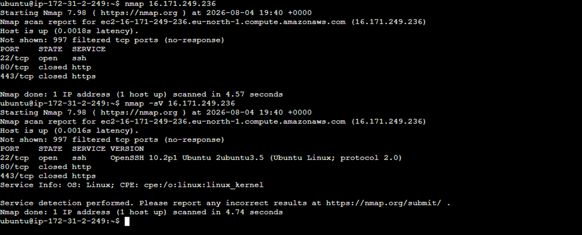
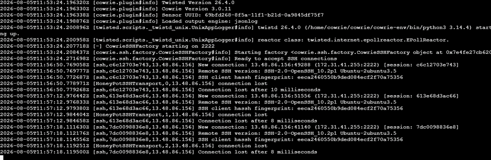

# Assignment 1 — Network Attack Detection & Reporting

A practical network-security lab covering honeypot deployment, network reconnaissance, attack capture, and defensive analysis. The lab was implemented on AWS EC2 rather than local VirtualBox machines.

> **Lab scope:** This work was performed in an isolated educational environment using intentionally controlled systems. The evidence here is included to document defensive-security skills and the complete lab workflow.

## What this project demonstrates

- Deploying a Cowrie SSH honeypot on Ubuntu
- Using a second Ubuntu EC2 instance with Kali/Linux security tools for testing
- Redirecting SSH traffic to Cowrie on TCP/2222 with iptables
- Performing network reconnaissance with Nmap
- Capturing traffic with tcpdump and preserving a PCAP artifact
- Reviewing Cowrie evidence such as connection attempts and authentication activity
- Translating observed attack activity into practical defensive recommendations

## Lab environment

| Component | Role |
|---|---|
| Ubuntu-Honeypot | AWS EC2 Ubuntu instance running Cowrie |
| Ubuntu-Attack | AWS EC2 Ubuntu instance used with Kali/Linux tooling |
| Cowrie | SSH honeypot and session logger |
| Nmap | Network reconnaissance/scanning |
| tcpdump | Packet capture and traffic evidence |
| iptables | Redirect TCP/22 traffic to Cowrie TCP/2222 |

## 1. Honeypot deployment

Two Ubuntu EC2 instances were created for the lab. The systems were updated and the dependencies required for Cowrie were installed.

The main setup flow was:

```bash
sudo apt update && sudo apt upgrade -y
python3 -m venv cowrie-env
source cowrie-env/bin/activate
```

The Cowrie repository was then cloned, the service was started, and its status was checked.

```bash
cowrie start
cowrie status
```

To expose the honeypot through the normal SSH port while keeping Cowrie on its own listening port, TCP/22 traffic was redirected to TCP/2222:

```bash
sudo iptables -t nat -A PREROUTING -p tcp --dport 22 -j REDIRECT --to-port 2222
```

### Evidence: Cowrie running


The screenshot documents the honeypot operating in the laboratory environment before the attack activity was generated.

## 2. Attack and reconnaissance phase

The attack started with an Nmap scan from the Ubuntu-Attack instance toward the Ubuntu-Honeypot instance. The scan generated TCP connection attempts that could be observed and captured on the honeypot side.

### Nmap evidence



The scan established which services were reachable and provided the initial reconnaissance stage of the exercise.

At the same time, tcpdump was used to capture network traffic. The resulting packet capture is included in the repository as `evidence/attack_capture.pcap` so the network activity can be reviewed independently in Wireshark or another packet-analysis tool.

## 3. Cowrie attack capture

Cowrie presented itself as an SSH service and recorded the resulting connection attempts. The honeypot captured useful telemetry including connection metadata, authentication attempts, timestamps, and session information.



This is important from a defensive perspective because the honeypot allows suspicious behaviour to be observed without exposing a real production service.

## 4. What I learned from the attack

The lab demonstrated the value of combining network-level telemetry with an application-level honeypot. Nmap provided reconnaissance visibility, tcpdump preserved the underlying packets, and Cowrie supplied higher-level information about the SSH interaction.

The result is a useful detection workflow:

1. Identify exposed services through reconnaissance.
2. Observe the resulting connection attempts at packet level.
3. Correlate those attempts with honeypot session data.
4. Use the evidence to understand attacker behaviour.
5. Apply the findings to hardening and monitoring decisions.

## 5. Defensive recommendations

The original lab identified the following defensive measures:

1. Restrict SSH access with firewall rules so the service is not unnecessarily exposed.
2. Disable password authentication and use SSH keys.
3. Change the default SSH port as an additional reduction in opportunistic scanning.
4. Monitor authentication logs continuously.
5. Deploy an intrusion-detection solution such as Snort to improve network monitoring.
6. Continue using honeypots as a source of threat intelligence about attacker entry methods, movement, and commands.

These controls should be viewed as complementary. Changing the SSH port alone is not a security boundary; access control, strong authentication, monitoring, and network segmentation provide the more important protections.

## Repository contents

```text
01-network-attack-detection-report/
├── README.md
└── evidence/
    ├── honeypot-running.png
    ├── nmap-scan-results.png
    ├── cowrie-logs.png
    └── attack_capture.pcap
```

## Key takeaway

The strongest part of this lab was not simply running a honeypot. It was correlating multiple sources of evidence: reconnaissance from Nmap, packet-level data from tcpdump, and SSH session telemetry from Cowrie. That workflow is directly relevant to defensive monitoring and incident investigation.
