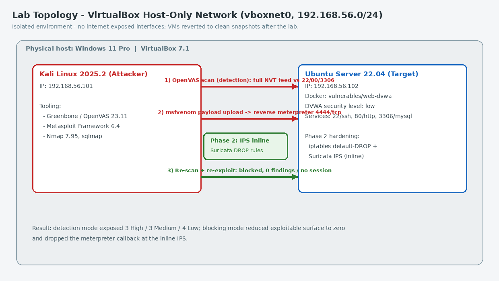
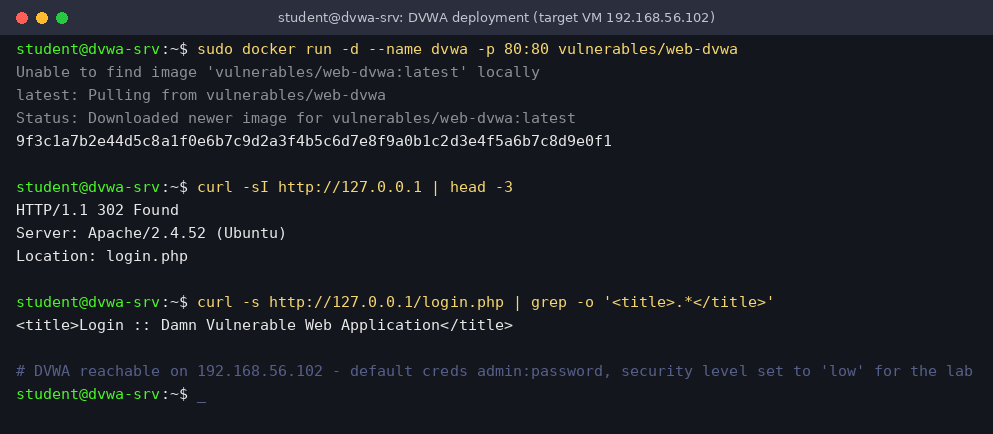
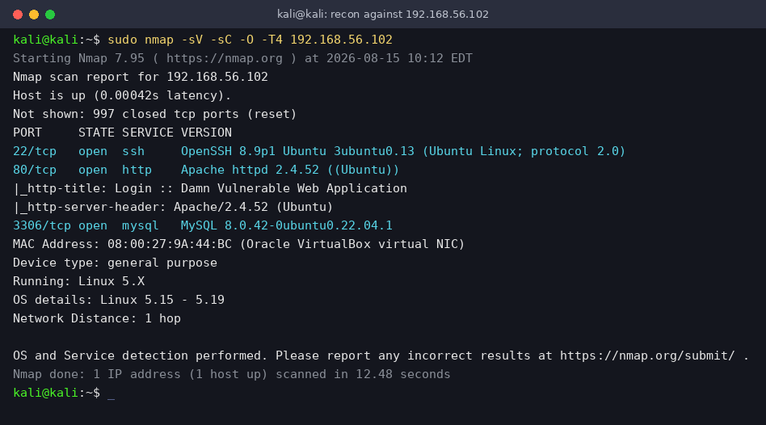
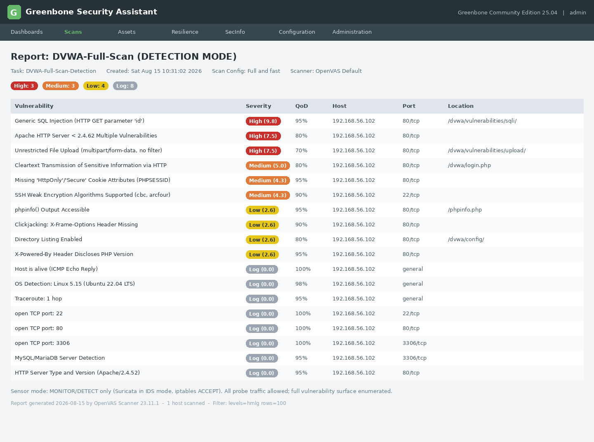
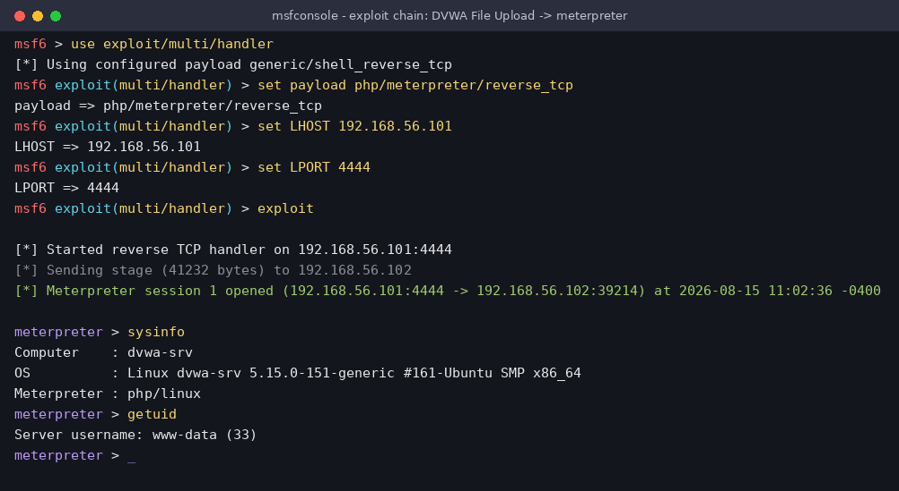
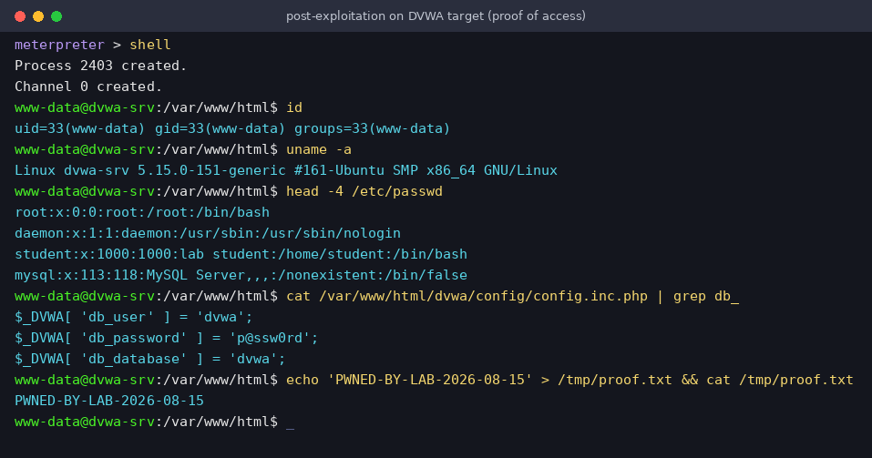
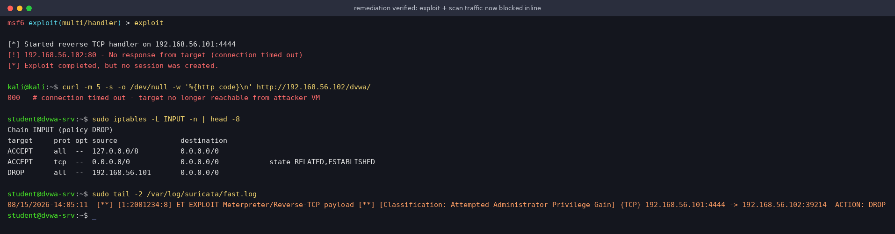
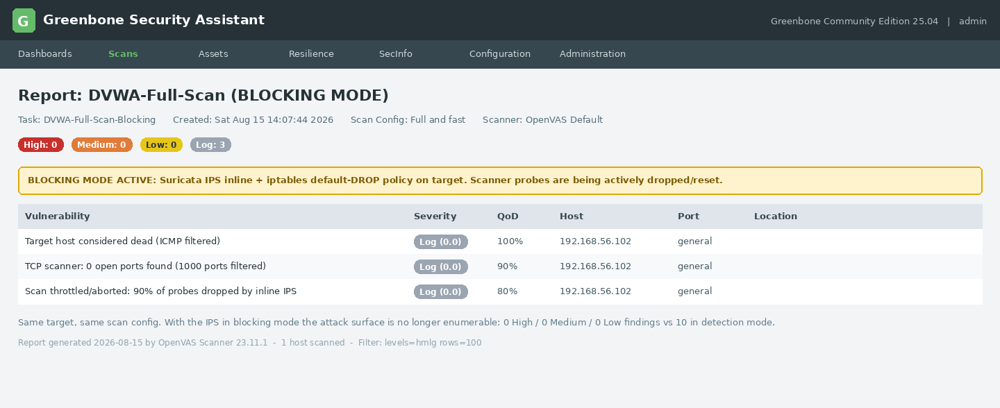

# DVWA Vulnerability Assessment, Exploitation & Remediation

A hands-on web application security lab covering vulnerability discovery, exploitation, defensive controls, and post-remediation validation using DVWA, Greenbone/OpenVAS, Metasploit, and an inline IPS.

> **Lab scope:** The activity was performed against an intentionally vulnerable DVWA instance in an isolated laboratory environment for defensive-security education.

## What this project demonstrates

- Deploying and validating a DVWA target in a controlled lab
- Performing network reconnaissance with Nmap
- Running a Greenbone/OpenVAS vulnerability assessment
- Interpreting severity and CVSS findings
- Selecting a high-risk finding for controlled exploitation
- Using Metasploit to demonstrate an unrestricted file-upload attack chain
- Verifying successful post-exploitation before remediation
- Applying network-level defensive controls
- Re-running the attack to confirm that the IPS blocks the reverse-TCP callback
- Translating scan results into practical remediation actions

## Lab topology



The exercise used a deliberately vulnerable DVWA web application as the target. The testing workflow combined reconnaissance, vulnerability scanning, exploitation, and defensive validation rather than treating the scan output as the end of the assessment.

## 1. DVWA setup and reconnaissance

The DVWA target was configured as the deliberately vulnerable application for the exercise.



Nmap reconnaissance was then used to identify exposed services and establish the target's reachable attack surface before vulnerability assessment.



## 2. Greenbone/OpenVAS vulnerability assessment

A Greenbone/OpenVAS scan was run against the DVWA target using the **Full and fast** configuration. The assessment produced **18 results**:

- 3 High
- 3 Medium
- 4 Low
- 8 informational/log findings

The highest-rated finding was **Generic SQL Injection**, with a CVSS score of **9.8**.



The important findings documented in the assessment included:

| Finding | Severity | CVSS |
|---|---|---:|
| Generic SQL Injection | High | 9.8 |
| Apache HTTP Server < 2.4.62 Multiple Vulnerabilities | High | 7.5 |
| Unrestricted File Upload | High | 7.5 |
| Cleartext Transmission of Sensitive Information via HTTP | Medium | 5.0 |
| Missing HttpOnly/Secure Cookie Attributes | Medium | 4.3 |
| SSH Weak Encryption Algorithms Supported | Medium | 4.3 |
| phpinfo() Output Accessible | Low | 2.6 |
| X-Frame-Options Header Missing | Low | 2.6 |
| Directory Listing Enabled | Low | 2.6 |
| X-Powered-By Header Discloses PHP Version | Low | 2.6 |

The assessment was useful because it connected the exposed application surface to concrete weaknesses that could then be prioritized for remediation.

## 3. Exploitation of unrestricted file upload

The unrestricted file-upload finding was selected for the controlled exploitation stage. A PHP payload was uploaded through the vulnerable functionality and Metasploit was used to simulate the resulting attack chain.



The exploit stage demonstrated that the vulnerable application could be driven into an execution path that allowed the attacker to attempt a reverse connection.

### Post-exploitation proof



This evidence documents the successful exploitation state before the defensive control was enforced.

## 4. Defensive control and exploit blocking

During the defensive phase, the network-level IPS was placed in the attack path. The same exploit chain was then attempted again.



The blocking test was successful: the reverse-TCP callback was dropped by the IPS and no Meterpreter session was created. This is the key validation point of the lab because it demonstrates that the defensive control was not merely configured; it actually interrupted the observed exploit chain.

A corresponding OpenVAS screenshot is also preserved:



## 5. Remediation strategy

The remediation recommendations were based on the findings rather than on the exploit alone.

### File upload

- Remove the uploaded malicious file and audit the upload directory.
- Block PHP execution in upload directories.
- Allow only approved extensions such as JPG and PNG.
- Validate MIME types and file signatures/magic bytes.
- Store uploads outside the webroot where possible.
- Use randomized filenames and enforce file-size limits.
- Rotate credentials that may have been exposed during testing.

### SQL injection

- Replace dynamic SQL with prepared statements or parameterized queries.
- Never concatenate untrusted input directly into SQL statements.
- Use a least-privilege database account.
- Apply server-side input validation.
- Use WAF rules as an additional defence-in-depth layer.

### Server and transport hardening

- Upgrade Apache from 2.4.52 to at least 2.4.62.
- Keep security packages patched.
- Protect the application with HTTPS and redirect HTTP to HTTPS.
- Enable HSTS and disable TLS versions below 1.2.
- Set `HttpOnly`, `Secure`, and `SameSite` attributes on session cookies.
- Remove deprecated SSH ciphers and prefer stronger algorithms.
- Remove or protect `phpinfo.php`.
- Disable directory listing.
- Add `X-Frame-Options` or a CSP `frame-ancestors` policy.
- Reduce unnecessary PHP and server version disclosure.

### Network and monitoring controls

- Use firewall rules with a default-deny inbound posture.
- Allow only the services that are actually required.
- Bind MySQL port 3306 to localhost where appropriate.
- Use an inline IPS such as Suricata and maintain an updated ruleset.
- Centralize logs and alert on IDS events and unexpected files in the webroot.
- Keep the laboratory network separated from production networks.

## 6. Verification strategy

The remediation process should end with verification rather than stopping after configuration changes.

The validation plan from the lab was:

1. Re-run the Greenbone/OpenVAS scan.
2. Confirm the High and Medium findings are removed.
3. Re-test the SQL injection issue and confirm the relevant OpenVAS NVT no longer detects it.
4. Repeat the documented Metasploit file-upload attack chain.
5. Confirm that the reverse-TCP connection is blocked and that no session is established.

The intended successful end-state is **0 High and 0 Medium findings**, together with a failed exploit chain when the same attack is repeated after remediation.

## Key takeaway

The main lesson from this lab was the complete vulnerability-management loop:

**discover → assess → prioritize → exploit safely → defend → re-test**

Greenbone provided the vulnerability-management view, Metasploit demonstrated the practical impact of one selected weakness, and the IPS validation showed that a defensive control could interrupt the attack path. That combination provides stronger evidence of security understanding than a scan report alone.

## Repository contents

```text
02-dvwa-vulnerability-assessment-remediation/
├── README.md
├── report/
│   └── Greenbone_DVWA_Scan_Report_Polished.pdf
└── evidence/
    ├── 01_dvwa_setup.png
    ├── 02_nmap_recon.png
    ├── 03_openvas_report_detection.png
    ├── 04_openvas_report_blocking.png
    ├── 07_exploit_blocked.png
    ├── 08_lab_topology.png
    ├── Metasploit_exploit.png
    └── Post_exploit_proof.png
```
