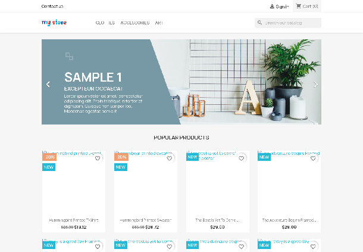
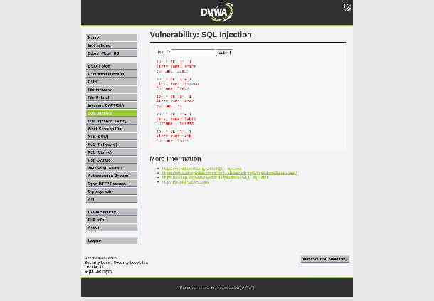
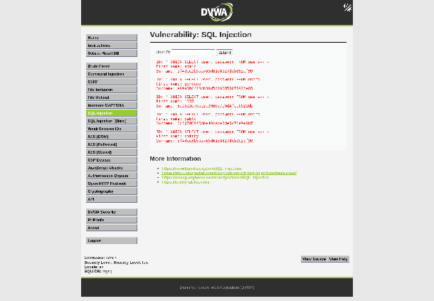
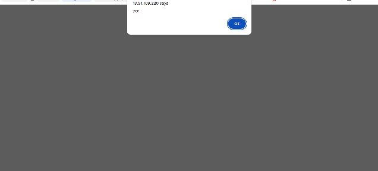
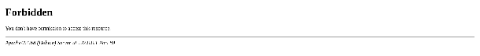
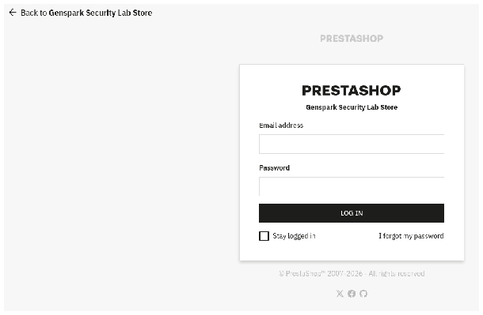

# Assignment 3 — Attack and Defend Web Application

A hands-on web application security lab covering offensive testing, Web Application Firewall deployment, defensive validation, and PrestaShop hardening. The lab was performed in a local laboratory environment using DVWA, PrestaShop 9.0.3, Apache, ModSecurity, and the OWASP Core Rule Set (CRS).

> **Lab scope:** All attacks documented here were performed against intentionally vulnerable/local laboratory applications. The evidence is provided for educational and defensive-security purposes.

## What this project demonstrates

- SQL Injection against DVWA, including tautology and UNION-based extraction attempts.
- Reflected Cross-Site Scripting against DVWA.
- ModSecurity deployment in blocking mode with OWASP CRS.
- Custom ModSecurity rules for SQLi, XSS, path traversal, PrestaShop installation probes, administrative-path access, and rate limiting.
- Verification that malicious requests changed from successful application responses to HTTP 403 responses after WAF enforcement.
- PrestaShop 9.0.3 deployment and security hardening.
- Black-box attack simulation against the hardened PrestaShop instance.
- Validation that legitimate application traffic continued to work.

## Environment

| Component | Role |
|---|---|
| DVWA | Intentionally vulnerable target for SQLi and reflected XSS |
| PrestaShop 9.0.3 | Application used for hardening and black-box testing |
| Apache | Web server and ModSecurity integration point |
| ModSecurity | Web Application Firewall |
| OWASP CRS 3.3.7 | Generic attack-detection rules |
| MariaDB | Application databases and backup/restore testing |

## Evidence

The screenshots below are extracted from the original lab report and kept as separate repository assets so the work can be reviewed without opening the original report.

### PrestaShop storefront



*Evidence 1 — PrestaShop storefront running in the laboratory environment.*

### DVWA SQL Injection — tautology



*Evidence 2 — DVWA SQL Injection tautology test succeeding before WAF enforcement.*

### DVWA UNION SQL Injection



*Evidence 3 — UNION-based SQL Injection returning database information before WAF enforcement.*

### Reflected XSS



*Evidence 4 — reflected XSS payload executing in DVWA before WAF enforcement.*

### WAF blocking



*Evidence 5 — malicious traffic rejected by the WAF with HTTP 403.*

### PrestaShop administration



*Evidence 6 — PrestaShop back-office login page using the randomized administration path.*


**OBJECTIVE**

The objective of this assignment is to attack vulnerable web applications, deploy a Web Application Firewall (WAF) to detect and block the attacks, and then verify that the defensive controls work without preventing legitimate application traffic. The lab used DVWA to demonstrate SQL Injection and reflected Cross-Site Scripting, followed by a hardened PrestaShop deployment used for additional attack simulation and security validation.


*Fig 1.0 An image of the PrestaShop storefront running in the laboratory environment*

**Attack scenario**

The first stage was performed with the WAF disabled so that the vulnerable applications could be tested under baseline conditions. DVWA was operated at a low security level, allowing the input fields to demonstrate common web application vulnerabilities.

**SQL Injection attack**

The first SQL Injection test used a tautology payload in the DVWA id parameter. The condition '1'='1' caused the database query to return multiple records rather than a single requested record. The application returned five user records and responded with HTTP 200, demonstrating that the input was reaching the SQL query without adequate validation or parameterization.

GET /dvwa/vulnerabilities/sqli/?id='+OR+'1'='1\&Submit=Submit


*Fig 2.0 An image of the DVWA SQL Injection tautology attack succeeding*

A second SQL Injection test used a UNION SELECT payload to append the contents of the users table to the application response. The result exposed usernames and password hashes, again with an HTTP 200 response. This demonstrated that an attacker could use the vulnerable query to obtain sensitive database information.

GET /dvwa/vulnerabilities/sqli/?id='+UNION+SELECT+user,+password+FROM+users--+-\&Submit=Submit


*Fig 2.1 An image of the DVWA UNION-based SQL Injection attack succeeding*

**Reflected XSS attack**

The next test targeted the DVWA reflected XSS function. A script payload was supplied through the name parameter. Because the input was reflected without suitable output encoding, the injected HTML and JavaScript executed in the browser context. The test produced a visible injected banner and an alert demonstrating access to the current session cookie.


*Fig 2.2 An image of the reflected XSS payload executing in DVWA*

**WAF deployment and configuration**

After the baseline attacks were demonstrated, ModSecurity was enabled in blocking mode and configured to use the OWASP Core Rule Set. Audit logging was also enabled so that blocked requests could be correlated with their rule identifiers and anomaly scores.

A custom rule file named 99-lab-waf.conf was added to provide additional protection for the laboratory applications. The rules were designed to block the SQL Injection and XSS patterns used against DVWA, guard PrestaShop request parameters, restrict the back-office path, block probes against the installation directory, prevent path traversal and apply temporary IP rate limiting after repeated blocked requests.

The configuration was validated with Apache before restarting the service. The successful configuration test confirmed that the WAF rules could be loaded without syntax errors.

SecRuleEngine On  
SecAuditLog /var/log/apache2/modsec\_audit.log

**Defence validation**

The same attack requests were then repeated while the WAF was enforcing the rules. The SQL Injection and XSS attempts that had previously returned successful application responses were instead rejected with HTTP 403 Forbidden responses. The blocked responses did not return the application data that had been exposed during the baseline tests.


*Fig 3.0 An image of the SQL Injection request being blocked by the WAF*


*Fig 3.1 An image of the XSS request being blocked by the WAF*

The logs provided additional evidence of the blocking decisions. The OWASP CRS anomaly-scoring rules identified the malicious payloads and the blocking phase returned HTTP 403\. The custom path-traversal rule also produced a phase-one block when a request attempted to use directory traversal sequences.

ModSecurity: Access denied with code 403 (phase 2\)  
\[id "949110"\] \[msg "Inbound Anomaly Score Exceeded"\]

\[id "100007"\] \[msg "LAB-100007: Path traversal attempt blocked"\]

A legitimate control request was also used to ensure that normal traffic was not unintentionally blocked. The laboratory result showed that legitimate traffic continued to receive normal application responses while the malicious requests were denied.

**PrestaShop deployment & security hardening**

PrestaShop 9.0.3 was deployed against a dedicated MariaDB database. The storefront was checked to confirm that the application was available and responding normally. The administrative back-office was also accessed through the randomized administration path created during installation.


*Fig 4.0 An image of the PrestaShop back-office login page*

The deployment was then hardened using a combination of application settings and WAF controls. The installation directory was removed, the webservice API was disabled, permissions were set for the application files and directories, and the back-office path was restricted through a WAF IP allow-list. Session cookies were observed with HttpOnly and SameSite attributes. Because the laboratory environment used plain HTTP on localhost, the Secure cookie flag and TLS enforcement were identified as controls that must be enabled before any real deployment.

The exercise also included database backup verification. Compressed MariaDB dumps were created for the PrestaShop and DVWA databases, and the backup files were checked for integrity and completeness. The documented recovery procedure used the compressed dump as the input to a MariaDB restore operation.

**PrestaShop attack scenario**

After hardening the store, a black-box attack simulation was conducted against the PrestaShop front office. The requests represented SQL Injection, XSS, path traversal, leftover installation-directory access and unauthenticated webservice/API access. A legitimate product search was also used as a control request.

The SQL Injection tests were rejected by the ModSecurity and OWASP CRS rules before the application could process the malicious query. The UNION-based test specifically attempted to extract customer information from the ps\_customer table and was blocked by the SQL Injection detection rules.

The reflected XSS request was also rejected with HTTP 403\. A path-traversal request attempting to escape the PrestaShop path and access a neighbouring application configuration file was blocked in the earlier request-processing phase by the custom traversal rule. A request to the leftover /install path was denied by the custom installation-directory rule.

The PrestaShop webservice endpoint returned 404 because the webservice was disabled. In contrast, the legitimate product search request continued to reach the application, showing that normal traffic was still being allowed.

**Defensive Recommendations**

I would take these measures to reduce the impact of similar attacks:

1\. Use parameterized queries and prepared statements for all database access so that user input cannot be interpreted as SQL code.

2\. Apply output encoding and context-appropriate input handling to prevent reflected and stored Cross-Site Scripting.

3\. Keep ModSecurity and the OWASP Core Rule Set enabled as a defence-in-depth layer, while tuning custom rules to the actual application environment.

4\. Restrict administrative interfaces by network policy or VPN, use strong authentication and add multi-factor authentication where possible.

5\. Remove unused installation files, disable unnecessary modules and services, and verify that sensitive directories cannot be browsed or reached through traversal sequences.

6\. Enable HTTPS and the Secure cookie flag in any non-laboratory deployment, and monitor WAF and application logs continuously for repeated attack attempts.

7\. Maintain tested database backups and periodically perform recovery tests so that security incidents do not become permanent data-loss events.

## Supporting files

**ModSecurity config file:**   
the original Google Drive document

**WFA config file:**   
the original Google Drive document

**prestashop attack simulation Logs:**  
the original Google Drive document

**WFA attack logs:**  
the original Google Drive document


## Repository contents

```text
03-attack-and-defend-web-application/
├── README.md
├── configs/
│   ├── 99-lab-waf.conf
│   └── modsecurity.conf
├── logs/
│   ├── prestashop_attack_simulation.log
│   └── wfa_attacks.log
└── evidence/
    ├── evidence-1.png
    ├── evidence-2.png
    ├── evidence-3.png
    ├── evidence-4.png
    ├── evidence-5.png
    └── evidence-6.png
```

## Key validation results

| Test | Before WAF | After hardening/WAF |
|---|---|---|
| DVWA SQLi tautology | Successful, HTTP 200 | Blocked, HTTP 403 |
| DVWA UNION SQLi | Successful, HTTP 200 | Blocked, HTTP 403 |
| DVWA reflected XSS | Executed | Blocked, HTTP 403 |
| PrestaShop SQLi | N/A in baseline | Blocked, HTTP 403 |
| PrestaShop XSS | N/A in baseline | Blocked, HTTP 403 |
| PrestaShop path traversal | N/A in baseline | Blocked, HTTP 403 |
| PrestaShop `/install/` probe | N/A in baseline | Blocked, HTTP 403 |
| PrestaShop `/api/` without key | N/A in baseline | HTTP 404 because webservice was disabled |
| Legitimate product search | N/A | Passed, HTTP 302 |

## Security lessons

This lab reinforced that a WAF is a **defence-in-depth control**, not a replacement for secure application development. Parameterized SQL queries, output encoding, least privilege, secure session configuration, patching, removal of unnecessary services, restricted administrative access, HTTPS, monitoring, and tested backups remain necessary controls.

The most useful part of the exercise was comparing the same attack traffic before and after defensive controls were applied. The change in application response and the corresponding ModSecurity/CRS log entries provided evidence that the controls were not merely configured, but actually enforced.
